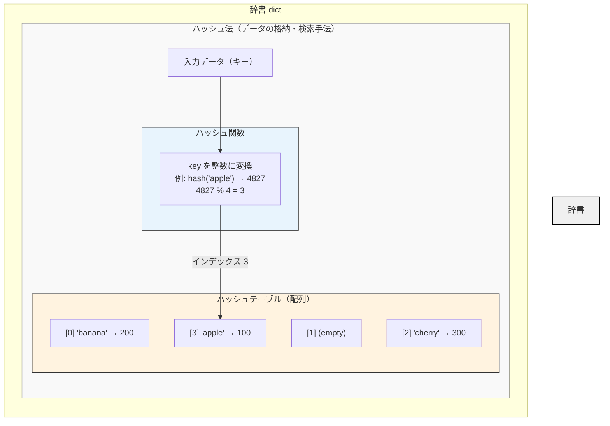

# Review memo

## Dictionary - 辞書 / ハッシュ法
https://onlinejudge.u-aizu.ac.jp/courses/lesson/1/ALDS1/4/ALDS1_4_C

## Point
### 解説
https://onlinejudge.u-aizu.ac.jp/resources/commentaries/ALDS1_4_C/ja/post?general=Algorithm

### 用語の使い分け
- ハッシュ関数 : キーを数値（位置）に変換する「関数」そのもの。h(k) = k mod 7 のような計算式です。
- ハッシュ法 : ハッシュ関数を使ってデータを管理する「手法・考え方」のこと。アルゴリズムの名前です。
- ハッシュテーブル : ハッシュ法を使って実際にデータを格納する「データ構造」（配列）のこと。
- 辞書（dict）: Pythonが提供するハッシュテーブルの「実装」です。中身はハッシュテーブルですが、ユーザーはそれを意識せず使えます。

### 全体像

